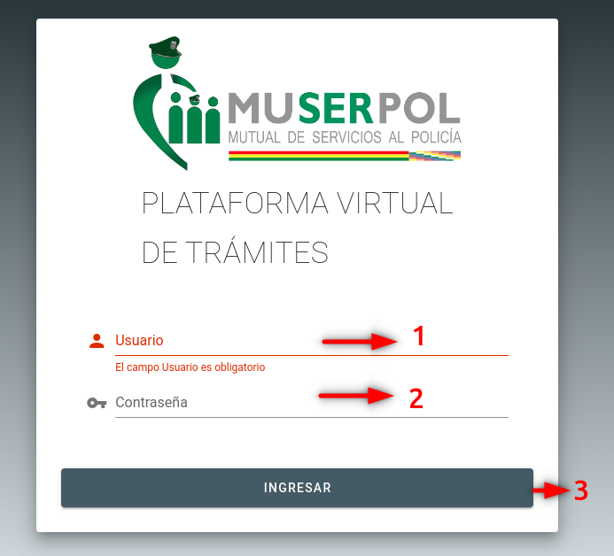
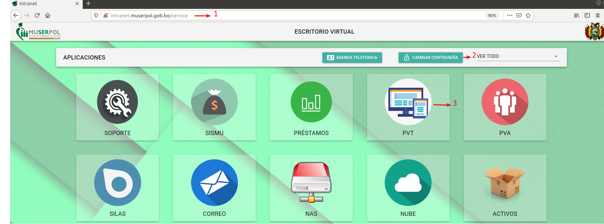
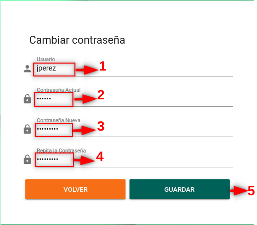
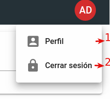
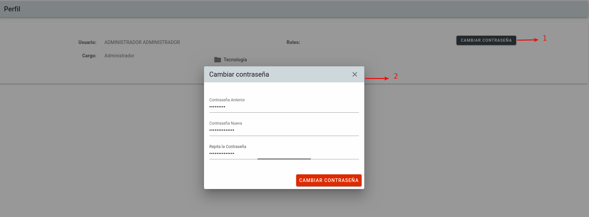
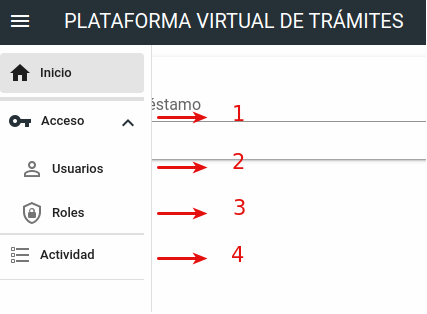
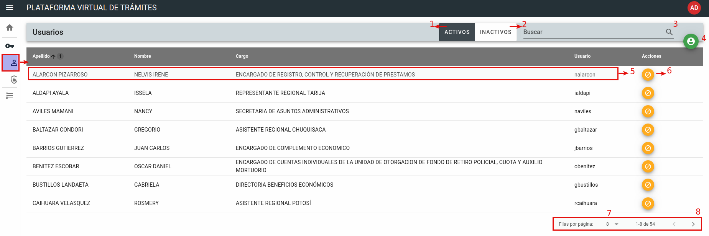
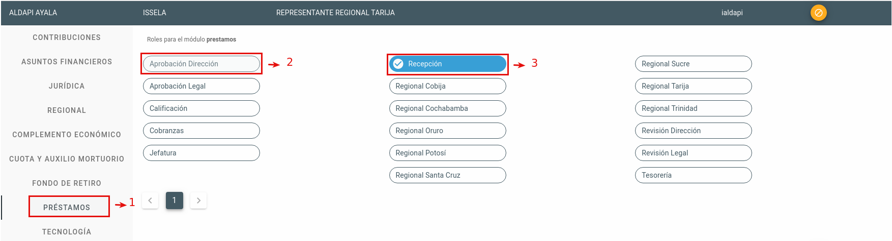
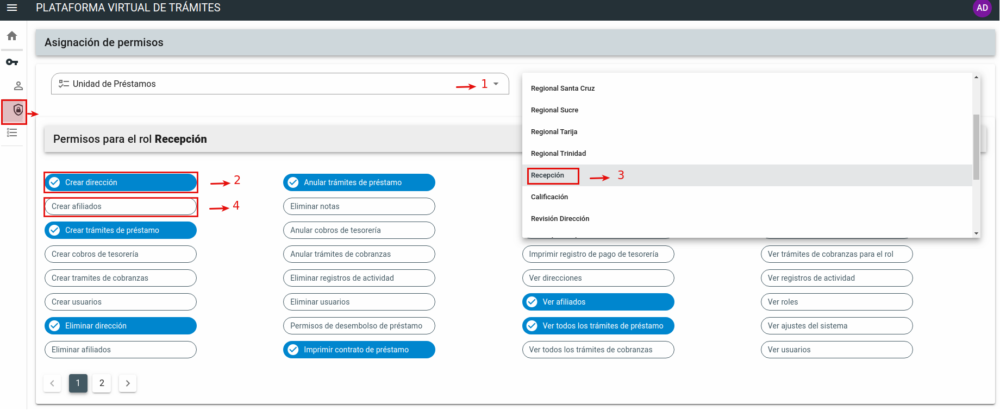
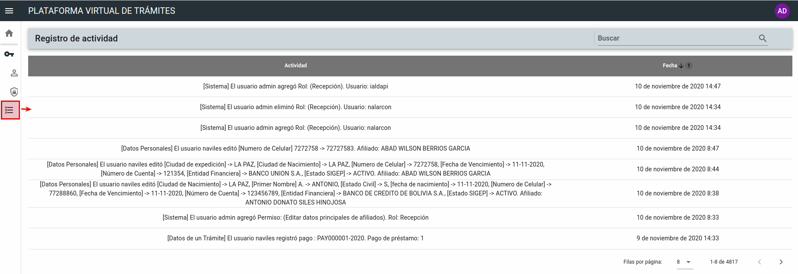

# **MANUAL DE USUARIO PLATAFORMA VIRTUAL DE TRAMITES - MUSERPOL**

  

  

### 1. INGRESO AL SISTEMA

  

  

Este sistema es compatible con los navegadores **Firefox y Chrome**, para acceder al sistema con la siguiente URL: [http://pvt.muserpol.gob.bo](http://pvt.muserpol.gob.bo). Una vez dentro se deben ingresar las credenciales en los campos de usuario y contraseña adquiridas por el responsable de la Unidad de Sistemas y Soporte Técnico.

  

***

  

  

  

  

  

  

  

  

***

  

**1:** Campo para ingreso del usuario asignado por el administrador.

  

  

**2:** Campo para ingreso de la contraseña asignada para el usuario administrador.

  

  

**3:** Por último debe hacer clic para ingresar, solo podrá ingresar si los datos registrados en el campo 1 y 2 son correctos, de lo contrario no podrá ingresar, de estar seguro que los datos ingresados son correctos informar al administrador del sistema para su verificación.

  

### 2. CAMBIO DE CONTRASEÑA

  

La primera acción a tomar es cambiar la contraseña proporcionada por el responsable de la Unidad de Sistemas y Soporte Técnico, esta acción se debe ejecutar en la [Intranet de la institución](http://intranet.muserpol.gob.bo/service):

  

***

  

  

***

  

A continuación debe hacer click en la opción de **CAMBIAR CONTRASEÑA** y llenar los campos requeridos.

  

***

  

  

***

  

Llenar formulario cambiar contraseña de la siguiente manera:

  

**1:** Nombre de usuario, por ejemplo para Juan Pérez el usuario será jperez.

  

**2:** Contraseña otorgada por el responsable.

  

**3:** Nueva contraseña.

  

**4:** Confirmación de la nueva contraseña.

  

**5:** Pulsar en volver para regresar al intranet.

  

**6:** Pulsar en guardar para cambiar contraseña.

  

#### 2.2. CAMBIO DE CONTRASEÑA DEl USUARIO ADMINISTRADOR

  

Después del login del usuario administrador, debe hacer clic en el botón ubicado en la parte superior derecha de la ventana con el nombre de usuario AD y te desplegara las siguientes opciones.

  

***

  

  

  

***

  

**1:** Al hacer clic en perfil se visualizara los datos del usuario y sus roles.

  

****

  

  

  

***

* Pulsar en el botón cambiar contraseña en el **Paso 1**, seguidamente se visualizara una ventana emergente señalada en el **Paso 2** donde al llenar el formulario y al pulsar en el botón **CAMBIAR CONTRASEÑA** tendrá cambiada su contraseña.

  

**2:** Hacer clic en Cerrar sesión para salir del sistema.

  

### 3. MENÚ DE NAVEGACIÓN LATERAL DESLIZANTE USUARIO ADMINISTRADOR

  

****

  

  

  

  

  

  

****

**1:** Hacer clic en Acceso se despliega un submenu con la opción de Usuarios y Roles.

  

**2:** Hacer clic en Usuarios para visualizar lista de usuarios.

****

  
  

  

  

  
  

  

****

  

* 1) Al hacer clic en el botón de **ACTIVOS** en la tabla se carga usuarios que tiene permiso de ingreso al sistema Plataforma Virtual de Tramites.

  

* 2) Al hacer clic en el botón de **INACTIVOS** en la tabla se carga usuarios que no tienen permiso de ingreso al sistema Plataforma Virtual de Tramites.

  

* 3) Campo para realizar búsqueda de Usuario por numero de C.I., nombre y apellidos, usuario y cargo.

  

* 4) Pulsar en el icono para agregar Usuario.

  
  

* 5) Hacer un clic para en el registro para asignar roles a un usuario.

  

  

  

  

  

	  

	En el Paso 1 del menú Izquierdo hacer clic en la opción Prestamos donde te visualizara los roles.

	En el Paso 2 te muestra como se visualiza un rol no asignado y para asignar el rol hacer clic en el botón del rol.

	En el paso 3 muestra como se visualiza un rol asignado y para quitar el rol hacer clic en el botón rol.

* 6) Hacer clic para habilitar o deshabilitar al el acceso al sistema del Usuario.

  

* 7) Campo para visualizsar de 8 ,15 y 30 registros por pagina.

  

* 8) Hacer clic para una pagina anterior o siguiente.

  
  

**3:** Hacer clic para dar permiso a los roles.

***

  

  

  

  

  

***

* 1) Seleccionar la Unidad de Prestamos.
* 2) Permiso asignado rol.
* 3) Seleccionar el rol al que se quiere asignar permisos. 
* 4) Permiso no asignado.

**4:** Hacer clic para ver registro de actividad de un los usuarios.

***

  

  

  

  

  

***

  