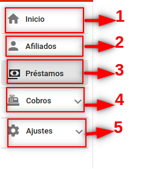

# **MANUAL DE USUARIO PLATAFORMA VIRTUAL DE TRAMITES - MUSERPOL**

  

### 1. INGRESO AL SISTEMA

  

Este sistema es compatible con los navegadores **Firefox y Chrome**, para acceder al sistema con la siguiente URL: [http://pvt.muserpol.gob.bo](http://pvt.muserpol.gob.bo). Una vez dentro se deben ingresar las credenciales en los campos de usuario y contraseña adquiridas por el responsable de la Unidad de Sistemas y Soporte Técnico.

***

  

  

  

  

***

**1:** Campo para ingreso del usuario asignado por el administrador.

  

**2:** Campo para ingreso de la contraseña asignada para el usuario administrador.

  

**3:** Por último debe hacer clic para ingresar, solo podrá ingresar si los datos registrados en el campo 1 y 2 son correctos, de lo contrario no podrá ingresar, de estar seguro que los datos ingresados son correctos informar al administrador del sistema para su verificación.

  
### 2. CAMBIO DE CONTRASEÑA

La primera acción a tomar es cambiar la contraseña proporcionada por el responsable de la Unidad de Sistemas y Soporte Técnico, esta acción se debe ejecutar en la [Intranet de la institución](http://intranet.muserpol.gob.bo/service):

***

***

A continuación debe hacer click en la opción de **CAMBIAR CONTRASEÑA** y llenar los campos requeridos.

***

***

Llenar formulario cambiar contraseña de la siguiente manera:

**1:** Nombre de usuario, por ejemplo para Juan Pérez el usuario será jperez.

**2:** Contraseña otorgada por el responsable.

**3:** Nueva contraseña.

**4:** Confirmación de la nueva contraseña.

**5:** Pulsar en guardar para cambiar contraseña.

#### 2.2. CAMBIO DE CONTRASEÑA POR EL ADMINISTRADOR

Después del login, debe hacer click en el botón ubicado en la parte superior derecha de la ventana con el nombre de usuario AD, esta acción abrirá el menú lateral:

***

  

  

  

***

**1:** Hacer click en perfil donde se visualizara datos del Usuario y los Roles. Pulsar en el botón cambiar contraseña seguidamente se visualizara una ventana emergente donde al llenar el formulario y al pulsar en el botón **CAMBIAR CONTRASEÑA** tendrá cambiada su contraseña.

**2:** Hacer click en Cerrar Sesión para salir del Sistema.

****

### 4. MENÚ DE NAVEGACIÓN LATERAL DESLIZANTE

****

  

  

****

  

**1:** Inicio.

  

**2:** Pulsar en Afiliados para la **Gestión de Afiliados** se visualiza una tabla con el registro de todos lo afiliados

****

  

  

  

****

-  **1:** Opción donde te ayuda a filtrar los registros por nombre o numero de C.I.

-  **2:** Acción ayuda a visualizar datos del afiliado a detalle y la creación de un tramite.

-  **3:** Filtro para visualizar un  numero de registro que se desea visualizar en la tabla en intervalos de 8, 15 y 30. a su lado se tiene en siguientes iconos  **<** y **>** que ayuda a desplazar  una pagina anterior  y pasar la siguiente pagina. 

  

**3:** Prestamos.

**4:** Cobros.

**5:** Ajustes.

### ASIGNACIÓN DE DESTINO DE PRÉSTAMOS

  

  

 **-1.** Seleccione un tipo de tramite.
 

  

  Al seleccionar un tipo de tramite  visualizar

  

  

  

-  **1:** Opción donde te ayuda a filtrar los registros por nombre o numero de C.I.

-  **2:** Acción ayuda a visualizar datos del afiliado a detalle y la creación de un tramite.

-  **3:** Filtro para visualizar un  numero de registro que se desea visualizar en la tabla en intervalos de 8, 15 y 30. a su lado se tiene en siguientes iconos  **<** y **>** que ayuda a desplazar  una pagina anterior  y pasar la siguiente pagina. 

  las diferentes Modalidades que tiene un Préstamo y crear un destino del préstamo

1: Seleccionar un tipo de trámite.

2: Hacer clic en el icono (+) para crear nuevo destino, seguidamente aparecerá una ventana emergente para añadir el destino del préstamo y su detalle.

3: Después de llenar el campo destino y detalle se habilitará el botón guardar.

4: hacer clic en guardar.

5: Pulsar en (+) para agregar, editar o eliminar.

### FLUJO DE TRABAJO DE TRÁMITES

En esta vista se define el flujo que seguirá un trámite en las diferentes modalidades

1.Seleccionar en módulo Unidad de Préstamos.

2: Seleccionar tipo de Trámite: Préstamo, Anticipo Préstamo a Corto Plazo ,Préstamo a Largo Plazo y Préstamo Hipotecario.